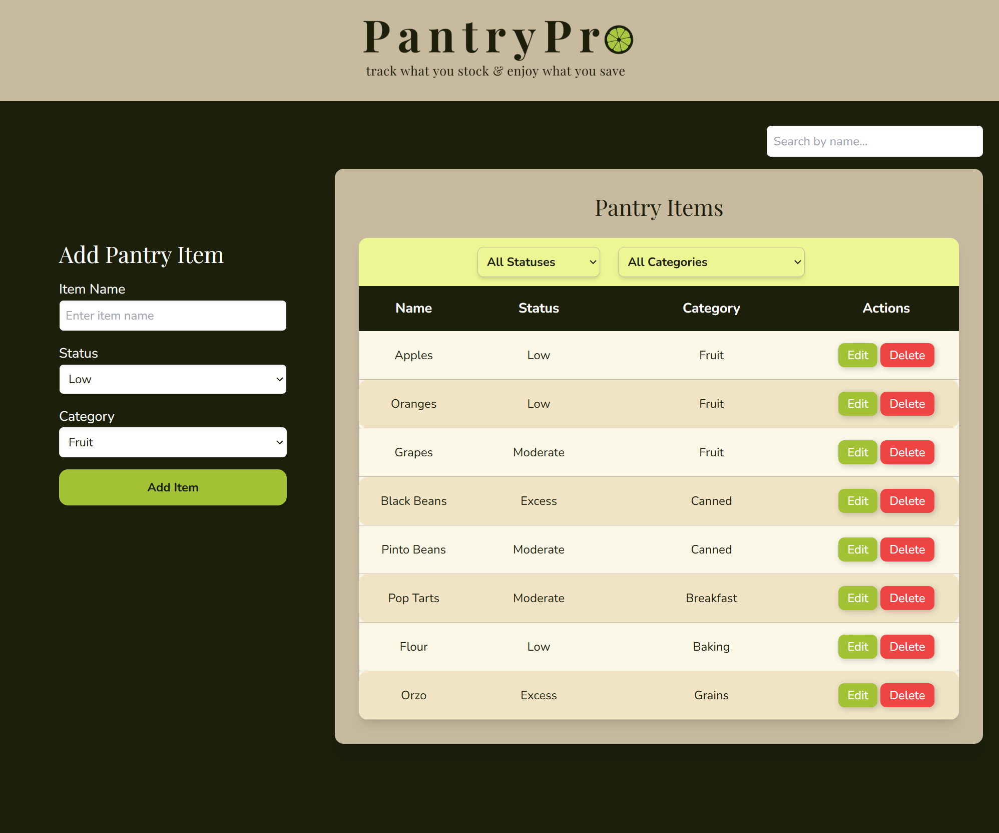
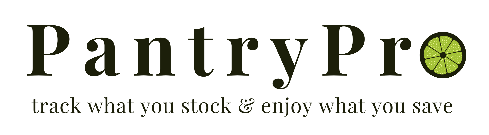

# Pantry Tracker

A sleek and intuitive pantry management app that helps users **track, organize, and manage** their pantry items efficiently. Designed with a modern UI and simple local storage for easy use.

## Deployment
Deployed with Vercel, check it out! 

[PantryPro](https://pantry-tracker-six.vercel.app/)

## Features

**Add Pantry Items** – Input item name, select status (Low, Moderate, Excess), and choose a category.  
**Local Storage** – Saves pantry items so they persist after refreshing.  
**Search & Filters** – Search by name, filter by status or category.  
**Edit & Delete** – Modify or remove pantry items directly in the table.  
**Modern UI** – Styled using Tailwind CSS for a clean and professional look.  

## Future Features
- Authentication
- Database via Prisma
- Customize your own categories and tables
- Tags for items
- Update table display to your liking
- Interactive for the fun of it (animated fruit will wiggle when hovered over)
- Prompts to review or shop for low items
- Connection to recipes and recipe database to prompt meal prep

## Preview
Landing page

Pantry page

Branding




## 🛠️ Tech Stack
- **Frontend:** Next.js (React), Tailwind CSS
- **State Management:** useState, useEffect
- **Data Persistence:** Local Storage

## 🏗️ Installation & Setup
### **Clone the Repository**
```sh
git clone https://github.com/yourusername/pantry-tracker.git
cd pantry-tracker


## Getting Started

First, run the development server:

```bash
npm run dev
# or
yarn dev
# or
pnpm dev
# or
bun dev
```

Open [http://localhost:3000](http://localhost:3000) with your browser to see the result.

You can start editing the page by modifying `app/page.js`. The page auto-updates as you edit the file.

This project uses [`next/font`](https://nextjs.org/docs/app/building-your-application/optimizing/fonts) to automatically optimize and load [Geist](https://vercel.com/font), a new font family for Vercel.

## Contact
Reach out to Parker with questions or suggestions:
[Parker Mikesell](https://github.com/sunny-script)

